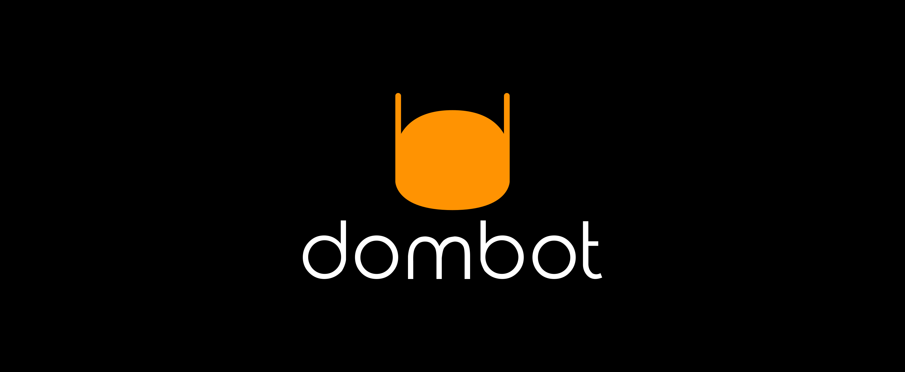

# logo
logo

# Color
+ #FF9302
+ #000000
+ #FFFFFF

# Font
Font in use Signika-Regular designed by Anna Giedryś and licensed under Open Font License. Icon Designed by Arsenty
+ Light
+ Regular
+ Semi-Bold
+ Bold

Font in use <a target="_blank" href="https://fonts.google.com/specimen/Signika">Signika-Regular</a> designed by
<a target="_blank" href="http://ancymonic.com/">Anna Giedryś</a>
and licensed under
<a target="_blank" href="http://scripts.sil.org/cms/scripts/page.php?site_id=nrsi&amp;id=OFL_web">Open Font License.</a>
Icon Designed by
<a target="_blank" href="https://thenounproject.com/arsenty">Arsenty</a>

### css 
    p {
       font-family: 'Signika';
       font-weight: normal;
       font-style: normal;
    }

### html

    <link rel="stylesheet" media="screen" href="https://fonts.google.com/specimen/Signika" type="text/css"/>
    

## 1

## 2

## 3

## 4

